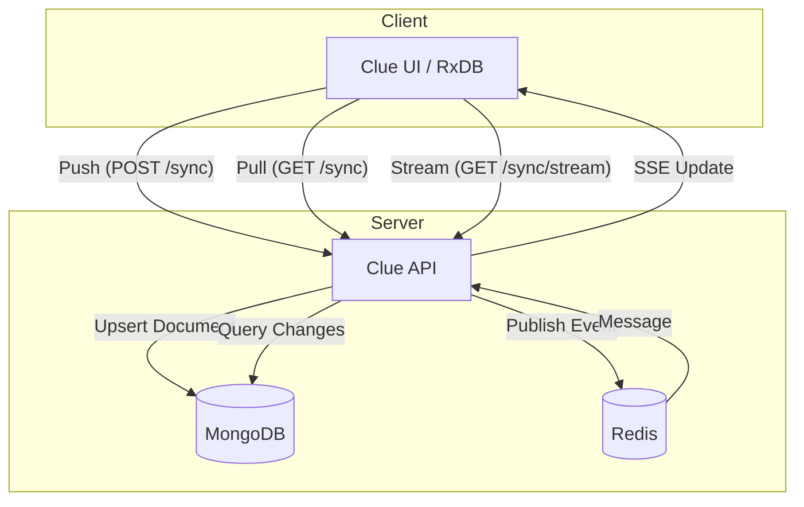

# Replication Design

This document outlines the design of the client-side replication feature in Clue, which enables offline-first capabilities and real-time synchronization of user data (specifically Selectors) between the UI and the server.

## Overview

The replication system is built to support [RxDB](https://rxdb.info/) (Reactive Database) running in the UI. It uses a custom replication protocol over HTTP, interacting with the Clue API to push changes, pull updates, and listen for real-time events.

## Architecture

The system involves the following components:

* **UI (RxDB)**: Manages the local database and handles the replication protocol.
* **Clue API**: Exposes endpoints for synchronization (`/sync`).
* **MongoDB**: Acts as the authoritative data store for user selectors.
* **Redis**: Used for Pub/Sub to broadcast changes to connected clients via Server-Sent Events (SSE).

### Component Interaction

## Data Model

The replication primarily deals with `SelectorDocument` entities stored in per-user collections in MongoDB (e.g., `{username}-selectors`).

Key fields for replication:

* `id`: Unique UUID.
* `updated_at`: Timestamp (epoch seconds) for conflict resolution and checkpointing.
* `_deleted`: Soft deletion flag (mapped to `deleted` in the model).

## API Endpoints

The `clue.api.v1.sync` blueprint provides the following endpoints:

* **`GET /api/v1/sync/<collection>` (Pull)**: Retrieves documents changed since a given `updated_at` checkpoint.
* **`POST /api/v1/sync/<collection>` (Push)**: Accepts a batch of changes (`ChangeRow`). It handles conflict detection by comparing the client's assumed state (`assumed_master_state`) with the server's current state.
* **`GET /api/v1/sync/<collection>/stream`**: Provides a Server-Sent Events (SSE) stream. It subscribes to a Redis channel (`{username}-selectors`) to push real-time updates to the client.

## Conflict Resolution

Conflict resolution occurs during the **Push** operation:

1. The client sends the `new_document_state` and the `assumed_master_state`.
2. The server checks if the document exists in MongoDB.
3. If the document exists and its `updated_at` timestamp differs from the `assumed_master_state` provided by the client, a conflict is detected.
4. The server returns the current server document as a conflict.
5. RxDB on the client side handles the conflict resolution logic.

## Backend Services

### Mongo Service (`clue.services.mongo_service`)

Handles direct interactions with MongoDB. It is responsible for:

* Initializing per-user collections with schema validation.
* Executing Pull queries.
* Executing Push updates and detecting conflicts.
* Publishing events to Redis upon successful updates.

### Redis

Used for the event stream to notify active clients of changes made by other sessions or devices. The `mongo_service` publishes a `PublishEvent` (containing the new documents and checkpoint) to the user's specific Redis channel.
