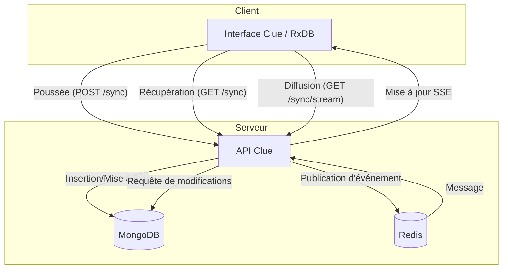

# Conception de la réplication

Ce document décrit la conception de la fonctionnalité de réplication côté client dans Clue, qui permet des capacités hors ligne en priorité ainsi que la synchronisation en temps réel des données utilisateur (plus précisément les Sélecteurs) entre l'interface utilisateur et le serveur.

## Vue d'ensemble

Le système de réplication est conçu pour prendre en charge [RxDB](https://rxdb.info/) (Reactive Database) s'exécutant dans l'interface utilisateur. Il utilise un protocole de réplication personnalisé via HTTP, en interagissant avec l'API Clue pour pousser des modifications, récupérer des mises à jour et écouter des événements en temps réel.

## Architecture

Le système implique les composants suivants :

* **Interface utilisateur (RxDB)** : Gère la base de données locale et prend en charge le protocole de réplication.
* **API Clue** : Expose des points de terminaison pour la synchronisation (`/sync`).
* **MongoDB** : Sert de magasin de données faisant autorité pour les sélecteurs utilisateur.
* **Redis** : Utilisé pour le Pub/Sub afin de diffuser les modifications aux clients connectés via les événements envoyés par le serveur (SSE).

### Interaction entre les composants

## Modèle de données

La réplication porte principalement sur les entités `SelectorDocument` stockées dans des collections par utilisateur dans MongoDB (par ex. `{username}-selectors`).

Champs clés pour la réplication :

* `id` : UUID unique.
* `updated_at` : Horodatage (secondes depuis l'époque) utilisé pour la résolution de conflits et les points de contrôle.
* `_deleted` : Indicateur de suppression logique (mappé sur `deleted` dans le modèle).

## Points de terminaison de l'API

Le blueprint `clue.api.v1.sync` fournit les points de terminaison suivants :

* **`GET /api/v1/sync/<collection>` (Récupération)** : Récupère les documents modifiés depuis un point de contrôle `updated_at` donné.
* **`POST /api/v1/sync/<collection>` (Poussée)** : Accepte un lot de modifications (`ChangeRow`). Gère la détection de conflits en comparant l'état supposé du client (`assumed_master_state`) avec l'état actuel du serveur.
* **`GET /api/v1/sync/<collection>/stream`** : Fournit un flux d'événements envoyés par le serveur (SSE). S'abonne à un canal Redis (`{username}-selectors`) pour transmettre les mises à jour en temps réel au client.

## Résolution de conflits

La résolution de conflits a lieu lors de l'opération de **Poussée** :

1. Le client envoie le `new_document_state` et le `assumed_master_state`.
2. Le serveur vérifie si le document existe dans MongoDB.
3. Si le document existe et que son horodatage `updated_at` diffère du `assumed_master_state` fourni par le client, un conflit est détecté.
4. Le serveur retourne le document serveur actuel en tant que conflit.
5. RxDB côté client gère la logique de résolution de conflits.

## Services back-end

### Service Mongo (`clue.services.mongo_service`)

Gère les interactions directes avec MongoDB. Il est responsable de :

* L'initialisation des collections par utilisateur avec validation de schéma.
* L'exécution des requêtes de récupération.
* L'exécution des mises à jour de poussée et la détection de conflits.
* La publication d'événements dans Redis après des mises à jour réussies.

### Redis

Utilisé pour le flux d'événements afin de notifier les clients actifs des modifications effectuées par d'autres sessions ou appareils. Le `mongo_service` publie un `PublishEvent` (contenant les nouveaux documents et le point de contrôle) dans le canal Redis spécifique à l'utilisateur.
